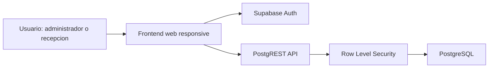
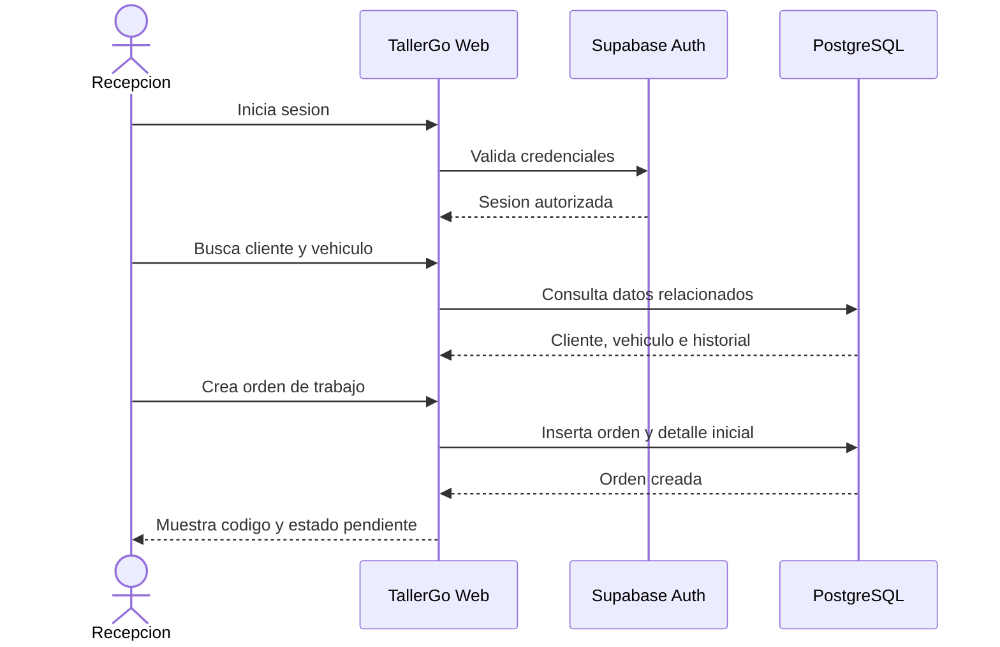
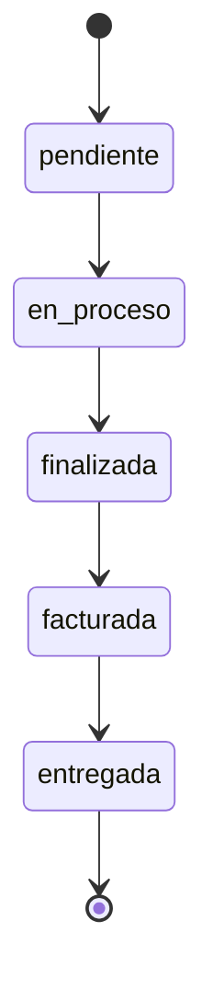

# Arquitectura del Sistema

## Vision general

TallerGo se plantea como una aplicacion web responsive con una arquitectura de tres capas: presentacion, servicios y datos. La primera version puede construirse con React en el frontend y Supabase como backend administrado.

## Capas

| Capa | Responsabilidad | Tecnologia propuesta |
| --- | --- | --- |
| Presentacion | Pantallas, formularios, navegacion y validaciones iniciales. | React + TailwindCSS |
| Servicios | Autenticacion, API REST automatica y reglas de acceso. | Supabase Auth + PostgREST + RLS |
| Datos | Persistencia transaccional y relaciones del dominio. | PostgreSQL |

## Flujo principal de una orden

## Estados de una orden

## Seguridad

- Cada usuario debe iniciar sesion antes de acceder al sistema.
- El rol del usuario define las operaciones disponibles.
- Las politicas RLS deben evitar que un usuario lea o modifique informacion no autorizada.
- Las operaciones sensibles, como eliminar registros o modificar pagos, deben reservarse al administrador.

## Decisiones tecnicas iniciales

- Usar identificadores UUID para las tablas principales.
- Registrar fechas de creacion y actualizacion para auditoria basica.
- Evitar eliminaciones fisicas en entidades principales; preferir campo `activo`.
- Separar detalle de servicios y detalle de repuestos para calcular totales con claridad.
